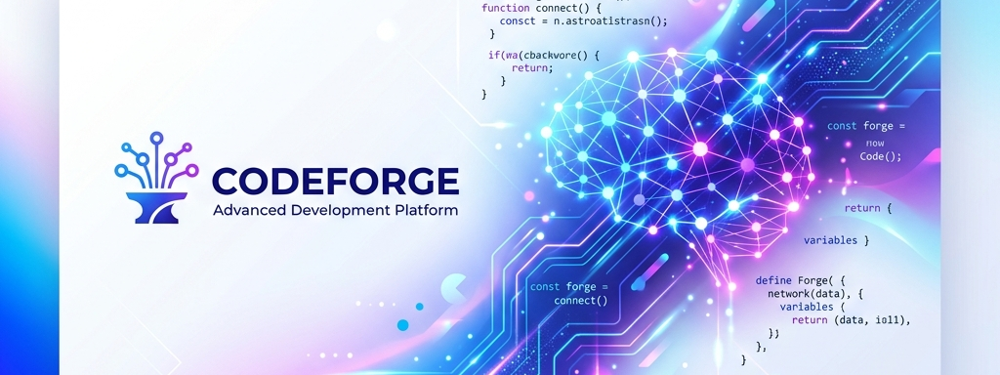
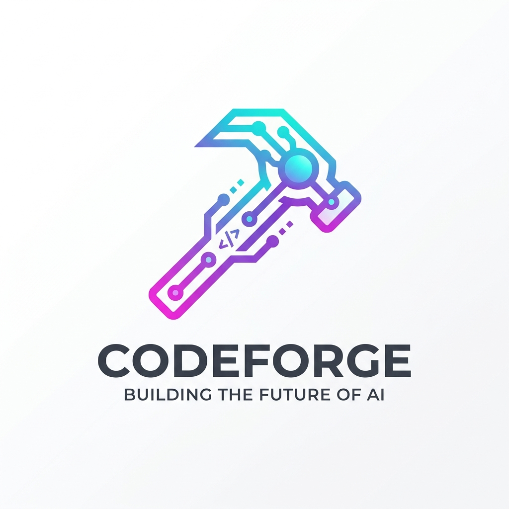

<div align="center">



<br />
<br />



# 🔨 CodeForge

### 社区开源贡献引擎 · Community Contribution Engine

**_看到 issue → 一句话装 CodeForge → 一句话让 Agent 完成 issue → 提 PR。_**

<p>
  <a href="./LICENSE"></a>
  <a href="./ETHICS.md"></a>
  <a href="#-新手开发者-15-分钟第一次贡献"></a>
  <a href="#-技能矩阵"></a>
  <a href="./docs/cn-api-providers.md"></a>
  
</p>

<p>
  <a href="#-新手开发者-15-分钟第一次贡献"><b>🚀 新手：15 分钟第一次贡献</b></a>
  ·
  <a href="#-技能矩阵"><b>技能矩阵</b></a>
  ·
  <a href="./docs/cn-api-providers.md"><b>🇨🇳 国内 API</b></a>
  ·
  <a href="#-熟练开发者本地部署"><b>本地部署</b></a>
  ·
  <a href="#-多-agent-分类部署"><b>多 Agent 部署</b></a>
  ·
  <a href="./CONTRIBUTING.md"><b>贡献指南</b></a>
</p>

</div>

---

## 📖 CodeForge 是什么

一个**为开源社区新手设计的 AI 开发脚手架**。把 24 个开发 skill + `deep-research` 深度调研引擎打包成一句话就能部署的工具集。

> **它不改变你的项目，它改变你 Agent 的能力。**
>
> 部署一次，Claude Code / Codex CLI / Gemini CLI 就懂 API-First、懂调研、懂调试、懂 CI/CD、懂发 PR。

---

## 🚀 新手开发者：15 分钟第一次贡献

> 从"没写过一行代码"到"给开源项目提 PR"，浏览器里就能完成喵～ φ(≧ω≦*)♪
>
> **你需要**：一个 GitHub 账号 · 一个 AI CLI 的 API Key（Anthropic / OpenAI / Google 任选其一）。

### 🗺️ 完整链路（一图看懂）

```
 ①社区 Project 面板    ②挑一个 issue          ③进入该项目仓库        ④点 Codespace 启动
 ─────────────────  ──────────────────  ──────────────────  ──────────────────
  PancrePal Projects   good first issue     openpancan / osintel     浏览器里的 VS Code
        │                    │                     │                        │
        ▼                    ▼                     ▼                        ▼
 ⑧提 PR 完成闭环    ⑦Agent 完成开发-       ⑥一句话让 Agent      ⑤一句话部署
 ─────────────────  测试-commit-push        接手 issue         CodeForge 脚手架
   gh pr create        (Agent 自主循环)      (贴 issue 链接)     (贴部署 prompt)
```

---

### Step 1 · 到社区总入口挑活

📌 **官方 Project 面板**：<https://github.com/orgs/PancrePal-xiaoyibao/projects>

看看 Kanban，找一个你能读懂的任务。**新手推荐**从下面这些开始：

<details>
<summary><b>🩺 osintel-pancrepal（胰腺癌开源情报）</b></summary>

- [#3 osintel 生产版本发布](https://github.com/PancrePal-xiaoyibao/osintel-pancrepal/issues/3)
- [#6 增强搜索工具箱 - 时效性和动态更新](https://github.com/PancrePal-xiaoyibao/osintel-pancrepal/issues/6)
- [#7 增强"看得懂"能力 - 非专业人员友好化](https://github.com/PancrePal-xiaoyibao/osintel-pancrepal/issues/7)
- [#8 视频内容整合 - 学术活动直播/录屏](https://github.com/PancrePal-xiaoyibao/osintel-pancrepal/issues/8)
- [#9 胰腺中心信息库 - 好医院/好医生/好服务](https://github.com/PancrePal-xiaoyibao/osintel-pancrepal/issues/9)
- [#10 Mock audit：填实模拟功能与生产验收缺口](https://github.com/PancrePal-xiaoyibao/osintel-pancrepal/issues/10)

</details>

<details>
<summary><b>🧬 openpancan（胰腺癌数据库集成，9 个 Phase）</b></summary>

- [Phase 1 COSMIC CGC 基因库](https://github.com/PancrePal-xiaoyibao/openpancan/issues/6) · [Phase 2 TCGA-PAAD](https://github.com/PancrePal-xiaoyibao/openpancan/issues/7) · [Phase 3 OncoKB](https://github.com/PancrePal-xiaoyibao/openpancan/issues/8)
- [Phase 4 STRING DB](https://github.com/PancrePal-xiaoyibao/openpancan/issues/9) · [Phase 5 GTEx](https://github.com/PancrePal-xiaoyibao/openpancan/issues/10) · [Phase 6 HPO](https://github.com/PancrePal-xiaoyibao/openpancan/issues/11)
- [Phase 7 ClinicalTrials.gov](https://github.com/PancrePal-xiaoyibao/openpancan/issues/12) · [Phase 8 DGIdb](https://github.com/PancrePal-xiaoyibao/openpancan/issues/13) · [Phase 9 测试验证与文档](https://github.com/PancrePal-xiaoyibao/openpancan/issues/14)
- [整体项目开发和上线](https://github.com/PancrePal-xiaoyibao/openpancan/issues/2)

</details>

<details>
<summary><b>🌐 .github（社区总览 & 跨项目）</b></summary>

- [#5 小胰宝官网重构](https://github.com/PancrePal-xiaoyibao/.github/issues/5)
- [#6 小胰宝开源协议仓库开发](https://github.com/PancrePal-xiaoyibao/.github/issues/6)
- [#8 Agent 项目性能与工程优化](https://github.com/PancrePal-xiaoyibao/.github/issues/8)
- [#9 deep-rapid-frontend-test 四类子任务分工](https://github.com/PancrePal-xiaoyibao/.github/issues/9)
- [#10 多场景测试与质量保证](https://github.com/PancrePal-xiaoyibao/.github/issues/10)
- [#11 AI4S 引擎融合与深度优化](https://github.com/PancrePal-xiaoyibao/.github/issues/11)
- [#12 knows-MCP 与快速 QA 工程优化](https://github.com/PancrePal-xiaoyibao/.github/issues/12)
- [#13 Frontend UI/UX 与社区价值观设计](https://github.com/PancrePal-xiaoyibao/.github/issues/13)
- [#14 Agent 自我迭代能力](https://github.com/PancrePal-xiaoyibao/.github/issues/14)

</details>

<details>
<summary><b>🧪 VitaForge（AI4S 医学干实验引擎，姐妹项目）</b></summary>

- [#1 引擎双模式优化：Rapid+Deep 分化开发](https://github.com/PancrePal-xiaoyibao/VitaForge/issues/1)

</details>

**认领 issue**：在 issue 下评论一句 `我想接手，会用 CodeForge Agent 开发，预计 X 天内提 PR`。

---

### Step 2 · 打开目标项目仓库，进入 Codespace

假设你选了 openpancan 的 Phase 1 (`https://github.com/PancrePal-xiaoyibao/openpancan/issues/6`)：

1. 打开仓库主页：<https://github.com/PancrePal-xiaoyibao/openpancan>
2. **右上角 `<> Code` 按钮 → `Codespaces` 标签页 → `Create codespace on main`**
3. 等 30 秒–2 分钟，浏览器里就打开一个完整的 VS Code。

> 💡 **每个 GitHub 账号有 60 小时/月免费 Codespace 额度**，日常小任务足够。开发结束以后记得及时关闭这个Codespace，不然会一直计时。

---

### Step 3 · 在 Codespace 里装一个 AI CLI

Codespace 终端里选一个安装（**任选其一**）：

```bash
# 选项 A：Claude Code
npm install -g @anthropic-ai/claude-code && claude

# 选项 B：OpenAI Codex CLI
npm install -g @openai/codex && codex

# 选项 C：Google Gemini CLI
npm install -g @google/gemini-cli && gemini
```

首次运行会提示登录/贴 API Key。搞定后你就有了一个"空白的 AI 副驾驶"——它现在还不懂 API-First、还不会做 deep research。

> [!IMPORTANT]
> **🇨🇳 国内开发者请看这里**：如果你无法访问 Anthropic 官方 API，Claude Code 支持通过环境变量指向**国产大模型**（智谱 GLM · DeepSeek · Kimi · 小米 MiMo · 硅基流动）。
>
> **🏆 首选推荐：智谱 GLM-5.2[1m]**（当前国产最强 Coding 模型，1M 上下文，对标 Claude Sonnet 4.6，起步 ¥20/月订阅制），端点：`https://api.z.ai/api/anthropic`
>
> Codespace / macOS / Linux 一分钟示例（GLM-5.2 · 推荐）：
> ```bash
> export ANTHROPIC_BASE_URL=https://api.z.ai/api/anthropic
> export ANTHROPIC_AUTH_TOKEN=your-API-key
> export ANTHROPIC_MODEL="glm-5.2[1m]"
> export ANTHROPIC_SMALL_FAST_MODEL=glm-4.7
> export CLAUDE_CODE_AUTO_COMPACT_WINDOW=1000000
> claude --permission-mode bypassPermissions
> ```
>
> 或性价比首选 DeepSeek：
> ```bash
> export ANTHROPIC_BASE_URL=https://api.deepseek.com/anthropic
> export ANTHROPIC_AUTH_TOKEN=your-API-key
> export ANTHROPIC_MODEL=deepseek-v4-pro[1m]
> export ANTHROPIC_SMALL_FAST_MODEL=deepseek-v4-flash[1m]
> claude --permission-mode bypassPermissions
> ```
>
> 完整六家供应商配置模板（bash / PowerShell / CMD 全平台）、`settings.json` 官方推荐方案、持久化技巧、一键切换函数、成本对照 → 📖 **[docs/cn-api-providers.md](./docs/cn-api-providers.md)**
>
> ✅ 已实测：GLM-5.2[1m] / DeepSeek-V4-Pro / Kimi-K2.7-Code / 小米 MiMo v2.5-pro[1m] 均可顺畅驱动 CodeForge 全流程 skill。**很多模型支持 1M 上下文，`[1m]` 后缀不要忘记加**（GLM/MiMo/DeepSeek 都是），Kimi K2.7-Code 是 256K，需要匹配 `CLAUDE_CODE_AUTO_COMPACT_WINDOW=262144`。

---

### Step 4 · 一句话部署 CodeForge 到 Agent 环境

> 🤖 **先分流**：你的 agent 属于哪一类？（不确定？看 [§ 多 Agent 分类部署](#-多-agent-分类部署)）
> - 🅰️ **A 类**（Claude Code / Codex / Gemini / Antigravity）→ 用下面【A 类提示词】，99% 用户走这条
> - 🅱️ **B 类**（OpenClaw / Hermes / WorkBuddy）→ 展开底部【B 类提示词】

#### 🅰️ A 类 · Claude Code / Codex / Gemini / Antigravity

**在 Agent 会话里，把下面这段完整贴进去**：

```text
请把 https://github.com/PancrePal-xiaoyibao/CodeForge 部署到当前用户的本机 Agent 环境。

要求：
1. 确认本机有 git 和可用 shell；如果缺依赖，先明确说明缺什么。
2. 克隆仓库到合适的本地目录；如果目录已存在且是 Git 仓库，先 git pull --ff-only。
3. 进入 CodeForge 仓库根目录后按系统执行：
   - Windows PowerShell: powershell -ExecutionPolicy Bypass -File .\deploy\deploy.ps1 -Yes
   - macOS / Linux Bash: chmod +x ./deploy/deploy.sh && ./deploy/deploy.sh --yes
4. 部署完成后确认存在下列之一：
   ~/.claude/commands/ai-spec.md
   ~/.codex/skills/ai-spec/
   ~/.gemini/skills/ai-spec/
5. 报告：部署路径、备份情况、下一步启动哪个 CLI。
```

Agent 会自动完成 git clone → 部署脚本 → 验证。**部署完成后，`/ai-spec` `/deep-research` `/api-first` 等 16+ 命令立即可用。**

> 💡 **部署后第一步（最佳实践）**：新机器 / 新项目 onboarding 时，在 Agent 会话里跑一次 **`/ai-spec init`** —— 它会自动探测本机环境、补齐开发工具，并把 CodeForge 的**全量注入文档**（规则铁律 + 环境画像 + 配色 + 网络拓扑等，~400 行性能全量档）写入 `~/.claude/CLAUDE.md` / `AGENTS.md` 及各 agent 镜像，让 Agent 后续行为完整遵守项目约定。之后任何需求都从 `/ai-spec` 主调度进入。

<details>
<summary><b>🅱️ B 类 · 用 OpenClaw / Hermes (hermas) / WorkBuddy？点这里展开分流提示词</b></summary>

B 类通用智能体没有官方 skill 目录约定，要走 `~/.agents/skills` **中立桥接层**接入 CodeForge。**在 Agent 会话里贴下面这段**（把 `[你的 agent 名]` 换成 OpenClaw / Hermes / WorkBuddy）：

```text
请把 https://github.com/PancrePal-xiaoyibao/CodeForge 部署到当前用户的本机 Agent 环境（B 类通用智能体路径）。

背景：我用的是 [你的 agent 名]，属于无官方 skill 目录约定的通用智能体（B 类），需要走 ~/.agents/skills 中立桥接层接入 CodeForge。

要求：
1. 确认本机有 git 和可用 shell；如果缺依赖，先明确说明缺什么。
2. 克隆仓库到合适的本地目录；如果目录已存在且是 Git 仓库，先 git pull --ff-only。
3. 进入 CodeForge 仓库根目录后按系统执行 deploy 脚本：
   - Windows PowerShell: powershell -ExecutionPolicy Bypass -File .\deploy\deploy.ps1 -Yes
   - macOS / Linux Bash: chmod +x ./deploy/deploy.sh && ./deploy/deploy.sh --yes
4. 部署完成后确认中立桥接层就位：
   ~/.agents/skills/ai-spec/SKILL.md
5. 根据我的 agent 类型激活桥接：
   - OpenClaw：配置 agent 读取 ~/.agents/skills/，或用 filesystem MCP 暴露该目录
   - Hermes (hermas)：对核心 skill 逐个跑 /learn（如 /learn ~/.agents/skills/ai-spec/SKILL.md）
   - WorkBuddy：在网页端配 MCP 指向 ~/.agents/skills/，或贴能力注入 prompt
6. 报告：部署路径、桥接层就位情况、agent 特定激活步骤是否完成、下一步。
```

> 📖 每个 B 类 agent 的完整接入步骤与原理 → [docs/agent-deployment-guide.md §5](./docs/agent-deployment-guide.md)

</details>

---

### Step 5 · 一句话让 Agent 接手 issue，完成完整闭环

**把下面这段贴给 Agent**（把 `<ISSUE_URL>` 换成你在 Step 1 选的 issue 链接）：

```text
请遵守下面这个 issue 的要求，完成一次开源贡献闭环：

Issue: <ISSUE_URL>

工作流（必须按顺序执行，每个环节完成后简报进度）：

【一、理解需求】
1. 用 gh CLI 读取 issue 的完整内容、评论与关联 discussion。
2. 若我尚未 fork，先 gh repo fork --clone 到当前目录并 cd 进去。
3. 从 main 建特性分支：feat/<slug> 或 fix/<slug>。

【二、规划】
4. 跑 /dev-env-scan 扫这个仓库的技术栈、构建/测试命令、既有约定。
5. 若 issue 涉及外部 API、数据源或不熟悉的领域，跑 /deep-research 补齐上下文并保留引用。
6. 跑 /ai-spec + /prd 输出结构化实现计划,拆 3-5 个 user story,标注 API-First 边界。
   把计划写到 docs/prd/<issue-number>.md,先展示给我确认。

【三、开发】
7. 我确认后,按计划实现:
   - 每个 story 走 /api-first(后端先, API doc, 前端只调 API)
   - 遇到 bug 走 /codebase-context -> /debug
   - UI 相关走 /debug-ui
   - 每个 story 完成后跑一次 /code-review,High 级问题必须修完
8. 补齐单元测试与集成测试;跑一遍项目自带的 test / lint / typecheck 命令。

【四、提交】
9. 所有 story 完成、测试全绿后,用 conventional commit 分批提交:
   feat/fix/docs/test/chore(<scope>): <一句话>
   commit message 末尾附:
     Closes #<issue-number>
     🤖 Generated with CodeForge (deep-research + ai-spec + api-first + code-review)
10. git push 到我的 fork 分支。
11. 用 gh pr create 开 PR,标题按 conventional commit,body 使用 CodeForge PR 模板,
    必填「AI 辅助披露」段,列出用到的 skill。
12. 在原 issue 下 gh issue comment,贴上 PR 链接,并 @ 相关维护者请求 review。

【硬性约束】
- 每完成一个大环节(规划、每个 story、提交)必须停下等我 review。
- commit 与 push 前必须获得我的明确「continue」授权,任何情况下不允许自主推送到 main / master。
- 生产环境凭据、真实用户数据一律不进代码库。
- 遵守本仓库(以及被贡献项目)的 LICENSE 与 ETHICS 要求;有冲突以严格者为准。
```

**Agent 会一边工作一边简报**。你只需要：
- 看 planning 阶段的 PRD，觉得靠谱就说 `continue`
- 看每个 story 的实现，觉得靠谱就说 `continue`
- commit / push / 开 PR 前，看一遍最终改动，说 `continue` 完成闭环

---

### Step 6 · 到 issue 下等 review

维护者会在 PR 上留 review 意见。有意见了直接贴回 Agent：

```
维护者说:「<粘贴 review 评论>」,请用 /debug 定位并修复,修完直接 push 到同一分支。
```

PR 更新会自动同步。**合并那一刻，你就是开源社区的贡献者了喵～** ヽ(✿ﾟ▽ﾟ)ノ

> 📘 完整规范（Commit 格式、PR 模板、AI 披露、伦理边界）→ **[CONTRIBUTING.md](./CONTRIBUTING.md)**

---

## 📊 技能矩阵

CodeForge 部署完成后，Agent 就获得下面这些能力：

| 场景 | 命令 | 干什么 |
|------|------|--------|
| 🎯 **主调度** | `/ai-spec` | 需求分诊、Repo Init、生成"可执行 AI 指令" |
| 🔍 **深度调研** | `/deep-research` | 多 agent 并行调研（技术选型 / 文献 / 竞品） |
| 🌱 **环境扫描** | `/dev-env-scan` | 扫技术栈、既有约定，输出 `.dev-profile.json` |
| 🧭 **需求追问** | `/intent-grill` | 模糊需求逐分支对齐，维护 CONTEXT.md |
| 📋 **PRD 生成** | `/prd` | 结构化 PRD 文档 |
| 🩺 **健康基线** | `/health-audit` | 变更前技术债扫描，输出债务登记表 + 影响图 |
| ✅ **SPEC 执行** | `/goal-driven` | 批准后 SPEC 证据化执行（里程碑循环 + 提交授权门） |
| 🔁 **迭代管理** | `/iteration` | 交付后残差分类（BUG/DEBT/修订/新变更）+ 下一 Gate |
| 🏗️ **API-First** | `/api-first` | 三层分离，5 步后端闭环 |
| 🐛 **代码调试** | `/debug` | 上下文优先调试，维护 `.debug/` |
| 🎨 **UI 调试** | `/debug-ui` | 前端视觉与渲染调试 |
| 🧠 **代码库图谱** | `/codebase-context` | 图谱查询（codebase-memory MCP 优先 + 降级）、影响分析、调用链 |
| 🔬 **代码审查** | `/code-review` | OCR CLI + Agent 混合，High/Medium/Low 分级 |
| 💫 **UX 审计** | `/ux-experience-audit` | 跨层用户体验诊断 |
| 🤖 **自主循环** | `/ralph` / `/ralph-yolo` | PRD 驱动的自主开发循环 |
| 🧩 **多 skill 编排** | `/loop-engineer` | 多 skill 联动 package 设计 |
| 💡 **技能机会发现** | `/discover-skill` | 从工作证据挖掘可打包 skill 的模式 + 会话复盘 |
| 📐 **工作流初始化** | `/sam-init` | PDCO 循环开发规范（CLAUDE.md/PROGRESS-LOG/TASKS/self.opt） |
| 🧬 **AI4S 干实验** | `/ai4s-lab` | 计算生物学端到端干实验引擎（SPEC+OODA+Gate，W1-W4） |
| 🧪 **方法论提取** | `/extract-framework` | 从深度研究文档反向提取可复用研究框架 |
| 🔐 **安全审计** | `/security-audit` | 全栈安全审计（图谱嵌入 + 分面审计 + CVE + 渗透 + `.debug/` 分级报告，只审计不修复） |
| 🚀 **CI/CD** | `/gh-actions` | GitHub Actions workflow（多生态、多架构） |
| 📦 **npm 发布** | `/nodejs-npm-auto-release` | 版本 + changelog + publish 全自动 |

---

## 🔌 推荐 MCP（可选，增强调研）

不装也能用；装上后 `/deep-research` / `/codebase-context` 更强：

- **codebase-memory-mcp** ([GitHub](https://github.com/DeusData/codebase-memory-mcp)) — ⭐ **强烈推荐**。把代码库索引为知识图谱，`/codebase-context` 调用 `search_graph / trace_path / query_graph` 查调用链、影响面、死代码、架构聚类，一次查询 ~500 tokens，比大范围 grep（~80K tokens）节省 99% 上下文。**先部署再调用本技能**：

  ```bash
  # macOS / Linux 一键安装
  curl -fsSL https://raw.githubusercontent.com/DeusData/codebase-memory-mcp/main/install.sh | bash
  ```
  ```powershell
  # Windows 一键安装
  Invoke-WebRequest -Uri https://raw.githubusercontent.com/DeusData/codebase-memory-mcp/main/install.ps1 -OutFile install.ps1
  Unblock-File .\install.ps1
  .\install.ps1
  ```
- **Tavily** ([申请](https://tavily.com/)) — 主力搜索
- **OpenAlex** ([申请](https://openalex.org/)) — 学术文献
- **GitHub MCP** ([申请](https://github.com/settings/tokens)) — issue / PR / code 搜索
- **Brave Search** ([申请](https://brave.com/search/api/)) — 隐私友好搜索
- **Playwright** — 浏览器自动化（无需 Key）

模板：[`deploy/mcp-config.template.json`](./deploy/mcp-config.template.json)

---

## 🖥️ 熟练开发者：本地部署

已经装好 Claude Code / Codex / Gemini 想在本机跑：

```bash
git clone https://github.com/PancrePal-xiaoyibao/CodeForge.git
cd CodeForge

# Windows PowerShell
./deploy/deploy.ps1 -Yes

# macOS / Linux Bash
chmod +x ./deploy/deploy.sh && ./deploy/deploy.sh --yes
```

装完直接 `claude` / `codex` / `gemini`，`/ai-spec` 就绪。

**Codespace 用户特权**：仓库自带 [`.devcontainer/`](./.devcontainer/)，Codespace 启动会自动装 CLI + 跑 deploy 脚本，**零手动步骤**。

---

## 🤖 多 Agent 分类部署

> 用 Claude Code / Codex / Gemini 之外的 agent？先判断它属于哪一类，再选部署路径喵～ (..•˘_˘•..)

CodeForge 把 agent 分两类，**判定标准只有一个**：该 agent 有没有**官方、稳定、文档化的 skill 加载目录约定**。

| 类别 | 判定 | 代表 agent | 部署方式 |
|------|------|-----------|---------|
| 🅰️ **A 类 · 专业 Agent** | 有官方 skill 目录约定 | Claude Code ⭐ · Codex · Gemini · Antigravity | deploy 脚本一键 merge，**零额外配置** |
| 🅱️ **B 类 · 通用智能体** | 无官方 skill 目录约定 | OpenClaw · Hermes (hermas) · WorkBuddy | 走 `~/.agents/skills` 中立桥接 + MCP / prompt 投喂 |

> 💡 deploy 脚本早就为两类 agent 都准备好了目录（A 类官方目录 + B 类中立桥接 `~/.agents/skills`），跑一次脚本全搞定。

**详细规则、5 问判定 Checklist、每个 agent 的完整三平台（bash / PowerShell / CMD）命令、混合编排、FAQ、新增 agent 归位指南** → 📖 **[docs/agent-deployment-guide.md](./docs/agent-deployment-guide.md)**

---

## 🤖 让 Agent 自己给 CodeForge 提 PR（进阶）

觉得某个 skill 有问题？直接跟你的 Agent 说：

```
/ai-spec 刚才没按 API-First 拆子任务,请:
1. 优化 .claude/skills/ai-spec.md 及 .codex/.gemini 三镜像,强化 workflow。
2. fork PancrePal-xiaoyibao/CodeForge,建分支 fix/ai-spec-enforce-api-first。
3. commit + gh pr create,PR 描述写清:现象、根因、三镜像 diff。
```

**一个 prompt → 改 skill → 三镜像同步 → fork → PR**。详见 [CONTRIBUTING.md § Path C](./CONTRIBUTING.md#-path-c--agent-自我优化闭环最酷的玩法)。

---

## 📜 License & Ethics

- [**LICENSE (BSL 1.1)**](./LICENSE) — 个人 / 教育 / 非营利 / OSS 贡献免费；商业生产需授权；**2030-07-02 后自动转 Apache 2.0**。
- [**ETHICS.md**](./ETHICS.md) — 人在回路、开源正直、禁恶意代码 / 供应链攻击 / AI 冒充 / 歧视性算法 / 武器双用途。

**核心承诺**：
- ✅ 用 CodeForge 贡献任何 OSI 开源项目 —— **永远免费，Additional Use Grant 明确允许**
- ❌ 把 CodeForge 嵌入商业 SaaS / 付费服务 —— **2030-07-02 前需授权**

---

## 💬 社区

- 🐛 **Bug / 建议**: [CodeForge Issues](https://github.com/PancrePal-xiaoyibao/CodeForge/issues)
- 🧭 **社区总入口**: [PancrePal-xiaoyibao Projects](https://github.com/orgs/PancrePal-xiaoyibao/projects)
- 🤝 **贡献指南**: [CONTRIBUTING.md](./CONTRIBUTING.md)
- 🇨🇳 **国内 API 配置**: [docs/cn-api-providers.md](./docs/cn-api-providers.md) — GLM-5.2[1m] · DeepSeek · Kimi · 小米 MiMo · 硅基流动
- 🔒 **伦理举报**: [ETHICS.md 第 7 节](./ETHICS.md#7-举报与反馈)
- 🌱 **姐妹项目**: [VitaForge](https://github.com/PancrePal-xiaoyibao/VitaForge)

---

<div align="center">


**🔨 看到 issue → 一句话装 CodeForge → 一句话让 Agent 干活 → 提 PR。喵～** (´｡• ᵕ •｡`) ♡

_If CodeForge helps you make your first OSS contribution, ⭐ the repo and tell us what you shipped._

</div>
